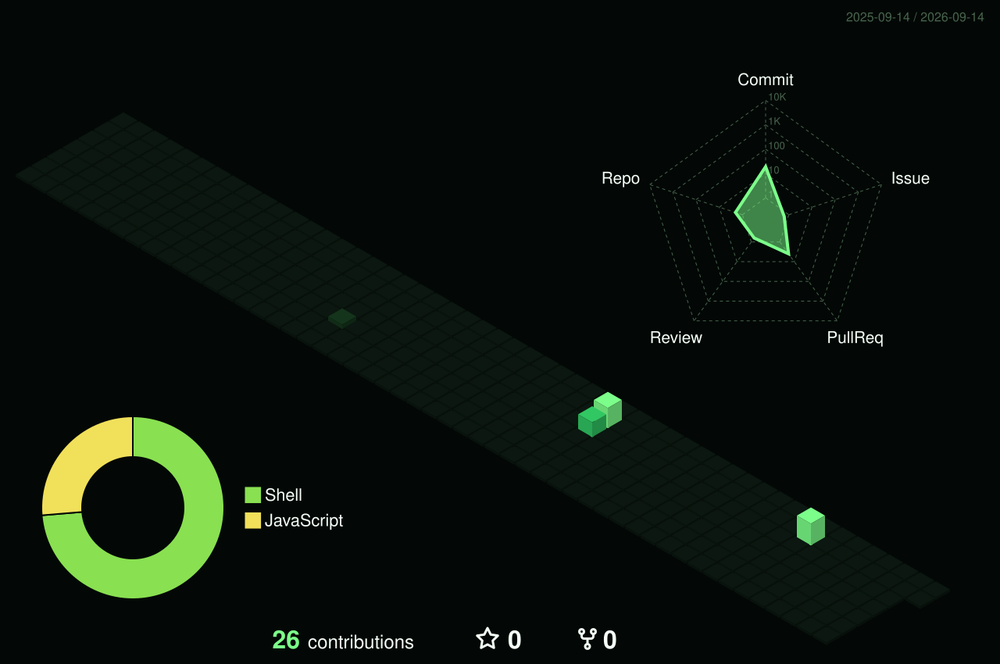

<p align="center">
  
</p>

<p align="center">
  <a href="#-operator_dossier">OPERATOR</a> ·
  <a href="#-activity_matrix---render3d">ACTIVITY</a> ·
  <a href="#-selected_program">PROGRAM</a> ·
  <a href="#-transmission">TRANSMISSION</a>
</p>

## `> operator_dossier`

<p align="center">
  
</p>

<details open>
  <summary><strong>DECRYPTED IDENTITY</strong></summary>
  <br>

I’m Kevin, a Java backend and DevOps developer focused on turning application code into reliable, repeatable deployments.

- **Runtime:** Java 21 · Spring Boot · REST · JPA · MySQL
- **Delivery:** Maven · Azure Pipelines · Ansible · Linux · Git
- **Current training:** Docker · Azure · integration testing
- **Mission:** Java Backend, DevOps, and Cloud Engineering opportunities

</details>

## `> activity_matrix --render=3d`

<p align="center">
  
</p>

## `> trace_contribution_signal`

<p align="center">
  
</p>

## `> selected_program`

<a href="https://github.com/kevintom2024-prog/dev">
  
</a>

<details>
  <summary><strong>OPEN PROJECT FILE</strong></summary>
  <br>

The **Student Management Platform** is a learning project combining a Spring Boot CRUD application with persistence, tests, an Azure CI pipeline, and Ansible-based server configuration.

`Java 21` `Spring Boot` `JPA` `MySQL` `JUnit` `Azure Pipelines` `Ansible`

[Inspect the source program](https://github.com/kevintom2024-prog/dev)

</details>

## `> engineering_directives`

```text
BACKEND     API design · persistence · validation · error handling · tests
DELIVERY    reproducible builds · CI checks · automation · rollback thinking
OPERATIONS  Linux administration · configuration management · observability
STATUS      building production-shaped Java backend systems
```

## `> transmission`

<p align="center">
  
</p>

<p align="center">
  <sub>There is no spoon. There is only the next deployment.</sub>
</p>

<!-- Add verified LinkedIn, portfolio, and professional email links here when available. -->
