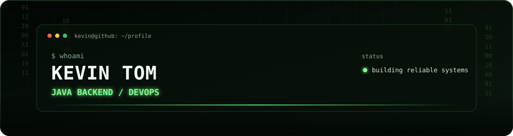

<p align="center">
  
</p>

<p align="center">
  <strong>Java Backend</strong> · <strong>DevOps</strong> · <strong>Cloud Automation</strong>
</p>

## `> whoami`

I’m Kevin, a Java backend and DevOps developer focused on turning application code into reliable, repeatable deployments.

- Building with **Java 21, Spring Boot, MySQL, Maven, and REST**
- Automating delivery with **Azure Pipelines, Ansible, Linux, and Git**
- Currently improving my testing, containerization, and cloud deployment workflow
- Open to **Java Backend, DevOps, and Cloud Engineering** opportunities

## `> selected_work`

### [Student Management Platform](https://github.com/kevintom2024-prog/dev)

A learning project that combines a Spring Boot CRUD application with persistence, tests, a CI pipeline, and Ansible-based server configuration.

`Java 21` `Spring Boot` `JPA` `MySQL` `JUnit` `Azure Pipelines` `Ansible`

## `> engineering_focus`

| Area | What I’m practicing |
| --- | --- |
| Backend | API design, persistence, validation, error handling, and tests |
| Delivery | Reproducible builds, CI checks, deployment automation, and rollback thinking |
| Operations | Linux administration, configuration management, and observable services |

## `> current_signal`

```text
learning   Docker · Azure · integration testing
building   production-shaped Java backend projects
seeking    backend / DevOps opportunities
```

---

<p align="center">
  <sub>Build clearly. Automate carefully. Improve continuously.</sub>
</p>

<!-- Add verified LinkedIn, portfolio, and professional email links here when available. -->
